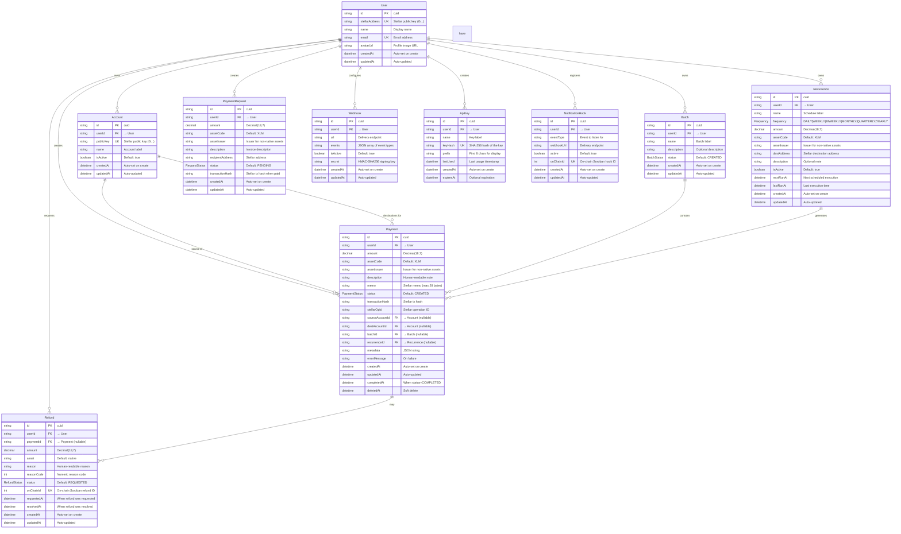

# 📊 Database Schema

> Entity-Relationship Diagram (ERD) of the OphirPay Prisma schema. This documents all models, their fields, and relationships.

---

## Entity-Relationship Diagram



---

## Enums

### PaymentStatus

| Value | Description |
|---|---|
| `CREATED` | Initial state — payment record created, not yet signed |
| `SIGNED` | Transaction signed by wallet, awaiting submission |
| `SUBMITTED` | Submitted to Stellar network, awaiting confirmation |
| `CONFIRMED` | Confirmed on-chain, awaiting final processing |
| `PENDING` | Awaiting manual approval (multisig) |
| `PROCESSING` | Actively being processed |
| `COMPLETED` | Successfully completed |
| `FAILED` | Failed — check `errorMessage` for details |
| `CANCELLED` | Cancelled by user or system |

### BatchStatus

| Value | Description |
|---|---|
| `CREATED` | Batch created, payments not yet processed |
| `PROCESSING` | Payments being processed in sequence |
| `COMPLETED` | All payments completed successfully |
| `PARTIALLY_COMPLETED` | Some payments succeeded, some failed |
| `FAILED` | Batch processing failed |

### Frequency

| Value | Description |
|---|---|
| `DAILY` | Every day |
| `WEEKLY` | Once per week |
| `BIWEEKLY` | Every two weeks |
| `MONTHLY` | Once per month |
| `QUARTERLY` | Every 3 months |
| `YEARLY` | Once per year |

### RequestStatus

| Value | Description |
|---|---|
| `PENDING` | Awaiting payment |
| `PAID` | Payment received |
| `EXPIRED` | Request expired before payment |
| `CANCELLED` | Cancelled by creator |

### RefundStatus

| Value | Description |
|---|---|
| `REQUESTED` | Refund requested, awaiting approval |
| `APPROVED` | Refund approved, awaiting processing |
| `REJECTED` | Refund rejected |
| `PROCESSED` | Refund processed on-chain |

---

## Key Relationships

| Relationship | Type | Description |
|---|---|---|
| User → Account | 1:N | A user owns multiple Stellar accounts |
| User → Payment | 1:N | A user creates multiple payments |
| User → Batch | 1:N | A user owns multiple batch groups |
| User → Recurrence | 1:N | A user has multiple recurring schedules |
| User → PaymentRequest | 1:N | A user creates multiple payment requests |
| User → Webhook | 1:N | A user configures multiple webhooks |
| User → ApiKey | 1:N | A user creates multiple API keys |
| User → Refund | 1:N | A user requests multiple refunds |
| User → NotificationHook | 1:N | A user registers multiple notification hooks |
| Account → Payment (source) | 1:N | An account is the source of multiple payments |
| Account → Payment (dest) | 1:N | An account is the destination of multiple payments |
| Batch → Payment | 1:N | A batch contains multiple payments |
| Recurrence → Payment | 1:N | A recurrence schedule generates multiple payments |
| Payment → Refund | 1:N | A payment may have multiple refund requests |

---

## Database Providers

OphirPay supports two database providers, switchable via the `DATABASE_PROVIDER` environment variable:

| Provider | Use Case | Connection |
|---|---|---|
| **SQLite** | Local development | `file:./dev.db` |
| **PostgreSQL** | Production (Neon, Supabase, RDS) | Connection string with pooling |

### Provider-specific notes

- **SQLite**: Used for local development with `npx prisma db push`. No migrations needed.
- **PostgreSQL**: Used in production with `npx prisma migrate deploy`. Supports connection pooling via `DIRECT_DATABASE_URL`.

---

## Generating the ERD

To regenerate this diagram from the Prisma schema:

```bash
# Option 1: Use prisma-erd-generator (generates SVG/PNG)
npx prisma-erd-generator --output docs/SCHEMA_ERD.svg

# Option 2: Use Mermaid CLI (renders the markdown diagram above)
npx @mermaid-js/mermaid-cli -i docs/SCHEMA.md -o docs/SCHEMA_ERD.svg

# Option 3: Use Prisma Studio (interactive GUI)
npx prisma studio
```

> The Mermaid diagram above is the source of truth. It's rendered automatically by GitHub, GitLab, and most markdown viewers without any build step.

---

## Indexes

The schema defines the following indexes for query performance:

| Model | Indexed Fields | Purpose |
|---|---|---|
| Account | `userId` | Fast lookup of accounts per user |
| Payment | `userId`, `status`, `batchId`, `recurrenceId`, `sourceAccountId`, `destAccountId` | Filter by user, status, batch, recurrence, or account |
| Batch | `userId`, `status` | Filter by user or status |
| Recurrence | `userId`, `nextRunAt` | Scheduler query for next execution |
| PaymentRequest | `userId` | Fast lookup per user |
| Webhook | `userId` | Fast lookup per user |
| Refund | `userId`, `status`, `paymentId` | Filter by user, status, or parent payment |
| NotificationHook | `userId`, `eventType` | Filter by user or event type |
| ApiKey | `userId`, `prefix` | Fast lookup by user or key prefix |

---

<div align="center">

**[← Back to OphirPay README](../README.md)**

</div>
